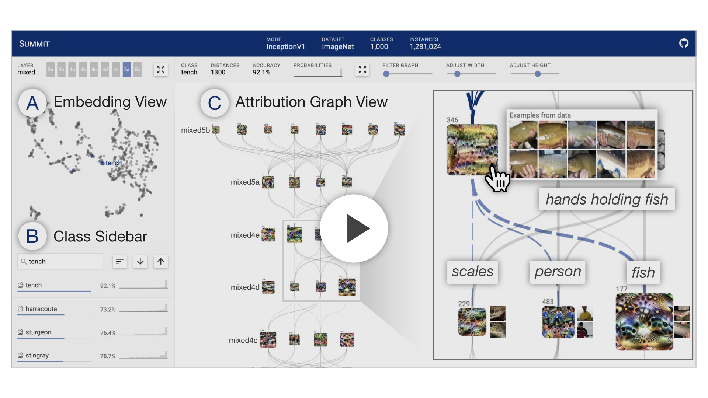

# Summit

```
NOTE: this project has not been announced yet, but will be at a later date. Please check back soon!
```

*Summit: Scaling Deep Learning Interpretability by Visualizing Activation and Attribution Summarizations*

Summit is a an interactive system that summarizes and visualizes what features a deep learning model has learned and how those features interact to make predictions.

[](https://youtu.be/J4GMLvoH1ZU)

For the Summit Notebooks code, go to [https://github.com/fredhohman/summit-notebooks][summit-notebooks].

For the Summit Data, go to [https://github.com/fredhohman/summit-data][summit-data].

***

## Live Demo

For a live demo, visit: [fredhohman.com/summit][demo]


## Installation

Download or clone this repository:

```bash
git clone https://github.com/fredhohman/summit.git
```

Within the cloned repo, install the required packages with npm:

```bash
npm install
```


## Usage

To run Summit:

```bash
npm run start
```


## Requirements

Summit requires [npm][npm] to run.


## License

MIT License. See [`LICENSE.md`](LICENSE.md).


## Contact

For questions or support [open an issue][issues] or contact [Fred Hohman][fred].

[summit-notebooks]: https://github.com/fredhohman/summit-notebooks
[summit-data]: https://github.com/fredhohman/summit-data
[npm]: https://www.npmjs.com
[fred]: http://www.fredhohman.com
[issues]: https://github.com/fredhohman/summit/issues
[demo]: https://fredhohman.com/summit/
